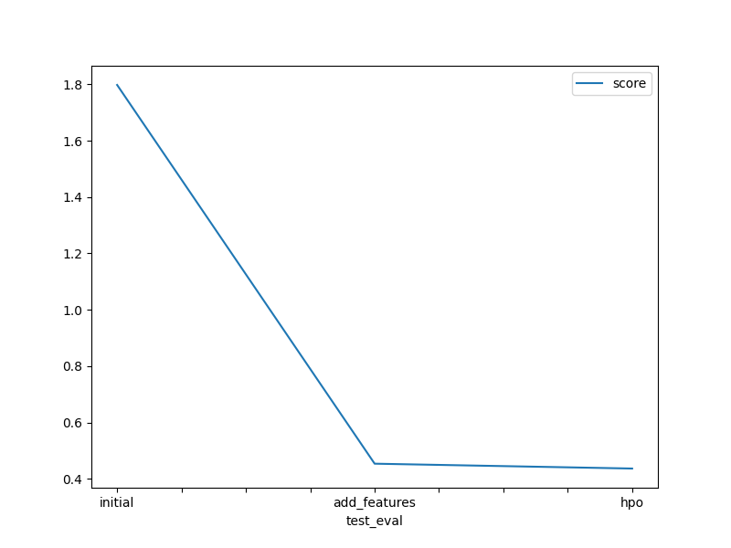

# Report: Predict Bike Sharing Demand with AutoGluon Solution
#### Rediet Million Moges

## Initial Training
### What did you realize when you tried to submit your predictions? What changes were needed to the output of the predictor to submit your results?

When submitting predictions for each experiment, I realized that there were differences in the outcomes generated and resulted in improved scores across all three main experiments for raw data prediction,feature addition, and hyperparameter optimization. Additionally, I observed that the autogluon tabular package handled most of the feature engineering and model selection internally.

The other thing is, to submit predictions to Kaggle using the submission file, I checked for negative values because Kaggle does not accept negative results. Luckily, I did not encounter any negative values during any of the three experiments.

### What was the top ranked model that performed?
The top ranked model was generated during the second experiment, which involved adding new features. The best performing model was `WeightedEnsemble_L3`, with an `RMSE` score of `34.160193` on the training dataset and a Kaggle score of `0.45403` on the predicted test dataset.

## Exploratory data analysis and feature creation
### What did the exploratory analysis find and how did you add additional features?
Exploratory analysis is useful for investigating a dataset before applying feature engineering and predicting outcomes.
It enables you to examine the distribution of the data, correlations between features, and visualize relationships with respect to the output using different graphs.

The following tasks were performed to add new features, drop unnecessary ones, and alter data types:

- The features `casual` and `registered` were dropped because they are only present in the training dataset.
- The feature `temp` was also dropped due to its high positive correlation with `atemp`, which is considered more relevant than normal temperature readings according to literature.
-  After parsing `datetime`, new features such as `year, month, dayofweek, and hour` were created because they are more relevant for predicting bike sharing demands.
- Features such as `season and weather` were transformed from integer data type to categorical data type because they have discrete and limited values.

### How much better did your model preform after adding additional features and why do you think that is?

After adding new features, the top model's RMSE decreased from 52.91 to 34.16, which is a 35% improvement, and the Kaggle score improved compared to the initial prediction result. This improvement can be attributed to the following main reasons:

- Dropping irrelevant or redundant features can reduce noise in the dataset and improve the accuracy of the model.
- Adding relevant features can provide additional information to the model, making it better at predicting the target variable.
- Transforming numerical features into categorical ones can help capture non-linear relationships between the features and the target variable.
- Parsing datetime features into separate components such as year, month, day, and hour can help the model understand periodic patterns in the data, which may be important in predicting demand for bike sharing.

## Hyper parameter tuning
### How much better did your model preform after trying different hyper parameters?
After trying different hyperparameters, even though the RMSE increased by a small amount, the model achieved a higher performance in terms of Kaggle score (0.45403 to 0.43679) compared to the previous model.

### If you were given more time with this dataset, where do you think you would spend more time?
If given more time to work with this dataset, I would like to explore additional potential outcomes by running AutoGluon for a longer period using a high-quality preset and improved hyperparameter tuning.

### Create a table with the models you ran, the hyperparameters modified, and the kaggle score.
|model|hpo1|hpo2|hpo3|score|
|--|--|--|--|--|
|initial|given default values|given default values|given default values|1.79786|
|add_features|given default values|given default values|given default values|0.45403|
|hpo|Model:NN_TORCH,GBM,CAT,XGB,FASTAI|learning_rate =5e-4|time_limit = 900|0.43679|

### Create a line plot showing the top model score for the three (or more) training runs during the project.

TODO: Replace the image below with your own.

### Create a line plot showing the top kaggle score for the three (or more) prediction submissions during the project.

TODO: Replace the image below with your own.

## Summary
In summary, AutoGluon was used as a powerful tool to automate machine learning tasks. To prepare the dataset for modeling, exploratory data analysis was performed prior to applying feature engineering. Before submitting predictions to Kaggle, negative values were checked because Kaggle does not accept negative results. Three experiments were conducted, and it was observed that adding new features generated the best performing model, resulting in a 35% improvement in RMSE and higher Kaggle score. Hyperparameter tuning was also performed, leading to a higher Kaggle score than the previous model despite a slight increase in RMSE. Given more time, exploring additional potential outcomes by running AutoGluon for a longer period using a high-quality preset and improved hyperparameter tuning would have been considered.

